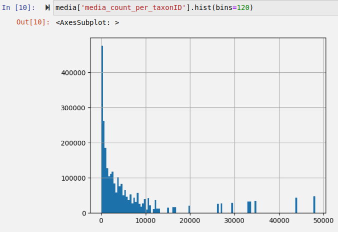
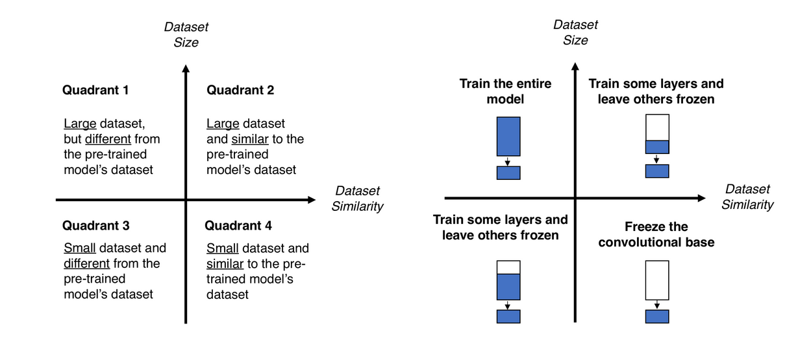
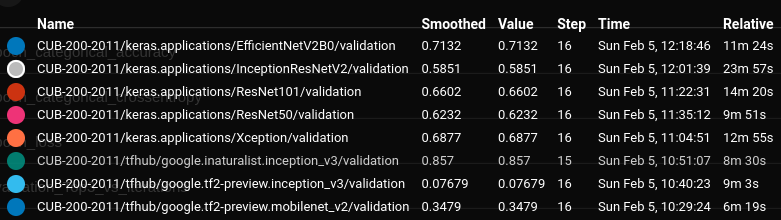
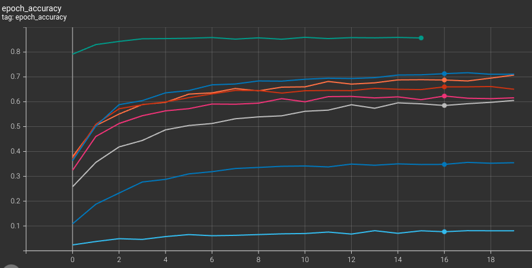
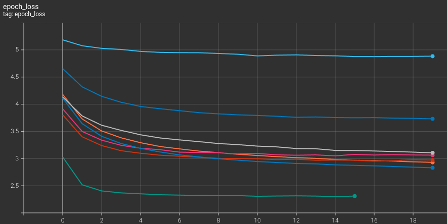

# An Adventurous Exploration of Image Classification and Machine Learning Training Pipelines through Species Identification
This Capstone Project represents the culmination of my education in UCSD's Machine Learning Engineering Bootcamp. I call it an "Adventurous Exploration" because at the start, I had a general idea of where I was going and what I wanted to acomplish but I didn't have a great understanding of the ML tooling landscape or how I might arrive where I wanted to be. It was certainly an adventure. As I progressed through the coursework and digested other resources online, I learned about and tested with various datasets, cloud services, packages and libraries. There were several times I reached dead ends and had to double-back but I learned a great deal throughout the process. Please forgive the lack of organization.

## The Problem
Being a fan of mycology and the natural world in general, the idea of training a machine learning model for species identification was very appleaing to me. Many times while hiking without cell service, I've come across interesting fungi that I wanted to identify. I would take a picture of them with the intention of identifying them later, but since it wasn't a high priority, I never got around to reviewing the pictures.

This project aims to remedy that by providing an application that serves an offline machine learning model to allow a user to take a picture of a fungus and get a reasonable idea of what species it may be in a matter of seconds. This should hopefully supplement the user's knowledge and understanding of fungus taxonomy.

The final application can be found at [ml.charlescoult.com](https://ml.charlescoult.com)

My work can be found in the following three repositories:
* [`ic`](https://github.com/charlescoult/fungi) (this repository)\
    My main project repository which contains `ic-serve` as a git-submodule under the `serve` directory but also the dockerized model-training-pipeline in the `train` directory.
* [`ic-serve`](https://github.com/charlescoult/fungi)\
    The web application found at [ml.charlescoult.com](https://ml.charlescoult.com) that allows a user to input an image URL from the web (assuming CORS is enabled on that resource) or an image from their device and use a selected model to predict labels for it. It is written in JS using Node, React and Express.
* [`fungi`](https://github.com/charlescoult/fungi)\
    My initial (rather unorganized) repository which contains explorations on datasets, cloud services, hyperparameter tuning and different feature extractor models for transfer learning (Resnet vs Inception vs Xception, etc.).

The class curriculum covered the following three main topics:
* [**Data**](#Data)
* [**Modeling and Algoithms**](#Modeling_and_Algorithms)
* [**Engineering and Deployment**](#Engineering_and_Deployment)

## Data
If there's one thing that has been drilled into my head from this class it's that data is the fuel of machine learning and a model is only as good as the data being fed into it. Finding or collecting good data, profiling it, and cleaning it are the essential first steps in training a model.

### Data sourcing
Initially, I had a very difficult time finding a good dataset of images with associated species labels. After days of searching, I was floored when I stumbled upon the [Global Biodiversity Information Facility (gbif.org)](https://www.gbif.org/). It is an aggregation of numerous biodiversity datasets found across the web and it simply blew me away with the wealth of observation datapoints it contains (over 2 billion).

Using GBIF's amazing search page I was able to see that its ["iNaturalist Research-grade Observations"](https://www.gbif.org/dataset/50c9509d-22c7-4a22-a47d-8c48425ef4a7) dataset contained 1.5 million image-media observation datapoints for the kingdom Fungi. I was also then able to easily download the filtered dataset for use in my project.

While exploring iNaturalist.org, I discovered that it implements a CNN image classification model to suggests potential species matches to users when they post observations. I found [associated blog posts](https://www.inaturalist.org/blog/63931-the-latest-computer-vision-model-updates), the [repository for the model training script](https://github.com/inaturalist/inatVisionTraining) and I was able to contact the creator, [Alex Shepard](https://www.inaturalist.org/people/44845), who was more than helpful. I didn't even expect a response back but he was quick to answer my questions and provide me with several tips, including pointing me to a smaller dataset, the [Caltech-UCSD Birds (CUB) dataset](https://www.vision.caltech.edu/datasets/cub_200_2011/), to start testing with. He also pointed me to several [Kaggle competitions](https://www.kaggle.com/search?q=inaturalist) done on iNaturalist datasets. I found a lot of the winners utilized advanced stacking and/or ensemble techniques. 

### Extract, Transform and Load (ETL) and Exploratory Data Analysis (EDA)
An important aspect of dataset generation is ensuring there are enough datapoints for each class to provide a good representation of those classes. This involves removing classes that have too few datapoints to yeild meaningful results and removing the 'long tail' of the class distribution. This is also known as 'downsampling' where classes at the higher end of a dataset class distribution (the long tail) are randomly sampled to include only a set number of datapoints in order to balance out the dataset.

#### GBIF dataset
It was interesting to find that the distribution of datapoints per taxa (class) followed a classic Pareto distribution in that the majority of datapoints belonged to a minority of classes.

  

My efforts toward exploring, cleaning and transforming the GBIF dataset I had downloaded (kingdom Fungi subset of "iNaturalist Research-grade Observations") can be foud in the [`fungi/gbif`](https://github.com/charlescoult/fungi/tree/main/gbif) repository folder.

The files are rather unorganized but in summary, they accomplished the following:
* Converting the text/csv files downloaded into a Pandas DataFrame and saving that dataframe to an HDF file
* Exploring the dataset and its distributions
* Determining relevant columns and removing irrelevant ones ([an example](https://github.com/charlescoult/fungi/blob/main/gbif/gbif_media_clean.ipynb))
* Determining class distribution and where downsampling cuts should be made
    * the minimum number of datapoints per class was set to 350, yeilding 2,451 classes
    * the main limiting factor was local drive space (1TB) and a rough calculation was done using the average file size of a 100 image sample to determine the above limit of 350 datapoints per taxa (class)
* Downloading images from the dataset
* Finding downloads that had failed and re-trying them until all downloads were successful
* Removing datapoints with corrupted image files (less than 50)

I also [ran 1000 images through AWS's Rekognition software](https://github.com/charlescoult/fungi/blob/main/gbif/gbif_media_cloud_AWS.ipynb) to see if it could help me with bounding-box isolation but I determined that the price was unjustifiable.

#### CUB and Flowers datasets
In order to keep a consistent dataset input format for my training script, I transformed the [CUB dataset](https://github.com/charlescoult/ic/blob/main/train/notebooks/dataset_cub_gen_df.ipynb) and [Flowers](https://github.com/charlescoult/ic/blob/main/train/notebooks/dataset_flowers_gen_df.ipynb) dataset from TensorFlow into HDF files and class-labeled directories of images.

#### Data Augmentation
Data Augmentation is a very useful technique for preventing a model from overfitting to the training dataset and performing more poorly on the validation or test datasets. In augmenting the images in different ways on each training epoch, the model learns to beter generalize its predictions.

In my initial model training Jupyter Notebooks I implemented a method for data augmentation (random zoom and random rotation) which did help with preventing overfitting but ultimately the increase in training time was not worth it in the initial training script development. I postponed further exploration into data augmentation until later in the project but didn't have time to re-implmenet it.

#### Upsampling
Upsampling is a technique to balance a dataset by generating datapoints for classes on the lower end of the distribution. There are several ways of generating new samples for a minority class, such as:
* SMOTE (Synthetic Minority Over-sampling TEchnique) - generates new samples by interpolating between existing datapoints - from my understanding though, I don't think this will actually work well, if at all, for image classification datasets. It is more commonly used for tabular datasets with continuous/numerical features. It would be interesting to see it applied to hidden feature layers or the output feature layer as opposed to the input layer.
* Autoencoder/GAN generative models - an Autoencoder or GAN is trained for each minority class using existing datapoints from that class. It is then employed to create novel representations of the class it was trained on by using random noise as an input. It would be interesting to see how a model performs that has been trained on a dataset comprised entirely of datapoints generated from Autoencoders or GANs.
* Data Augmentation - while it can be used to augment existing images in a dataset from epoch to epoch (as stated above), it can also be used to generate more datapoints for minority classes in an imbalanced dataset.

Again, I didn't have time to implement and of these techniques but it is something I will likely explore in the future.

### Final datasets
I ended up with three labeled image classification datasets, each with a different level of complexity:

| Key | Datapoints | Classes |
| :---: | ---: | ---: |
|`flowers` | 3670 | 5 |
| `cub` | 11788 | 200 |
| `gbif` | 665803 | 2451 |

I realize the number of classes for `gbif` seems a bit high but I wanted to see how far I could push the model and it ended up performing relatively well.

Also of note: These are just the source dataset DataFrames passed to the training engine. Based on run parameters set but the `run_config` supplied, the source dataset DataFrame can be downsampled (and eventually upsampled in future version) by the training engine. 

## Modeling and Algorithms
For image classification, the obvious and historical choice is to use a Convolutional Neural Network (CNN). There are several different architectures available.

### Model Algorithm and Architecture Selection
In order to speed up training time, I utilized transfer learning. This involves loading a pre-trained model with weights from another, similar dataset and removing the classification dense layer(s) in order to expose the model's final encoded feature layer for use by our own classification layer. A layer freezing strategy is then selected (as shown below) and the model is trained using the new dataset.

  

For most training runs I opted to train the entire model (Quadrant 1) because I had a large dataset and I was able to obtain the best results using that strategy. In the future I'd like to test stacking training runs of different freezing strategies to see if a more efficient/faster training strategy can be found.

Conveniently, there are a number of image classification CNN models available that have been pre-trained on the popular image classification dataset, [ImageNet](https://www.image-net.org/), plus [one that I found](https://tfhub.dev/google/inaturalist/inception_v3/feature_vector/5) which utilizes a dataset extracted from the same site that I created my Fungi dataset from: [iNaturalist.org](https://inaturalist.org). Unsuprisingly, this pretrained model seemed to perform the best on my test dataset (as visualized through TensorBoard graphs below).

The enumeration of models I chose for comparison can be found [here](https://github.com/charlescoult/ic/blob/main/train/src/run/base_model.py). They have been sourced directly from [Keras's API](https://www.tensorflow.org/api_docs/python/tf/keras/applications) and [Tensorflow Hub](https://tfhub.dev).

  

  

  

The full comparison can be found [here](https://charlescoult.notion.site/14-8-7-Experient-With-Various-Models-37e33e3f53984891b11e42a6d4ee67c8)

### Hyperparameter Tuning

#### Initial Training Scripts
My initial model training scripts can be found in [`fungi/models`](https://github.com/charlescoult/fungi/tree/main/model), the final draft of which is [`gbif_02.ipynb`](https://github.com/charlescoult/fungi/blob/main/model/gbif_02.ipynb).

From these initial training scripts I generated a simple [grid-search](https://github.com/charlescoult/fungi/blob/main/model/grid_search.py) program. The results of which can be found [here](https://www.notion.so/charlescoult/14-8-7-Experient-With-Various-Models-37e33e3f53984891b11e42a6d4ee67c8?pvs=4#fa6e6e23018a43209bce0fe7090e8af1).

#### Modular Training Scripts
As an engineer who values efficiency, I'm a big fan of automation. While iterating on models, I found that I was having trouble aggregating all the model metadata (training logs, scoring, parameters, etc.) into an easily comparible form. I needed a consistent and automated way to store all the relevant data for each model for later comparison and analysis.

One option was Tensorflow's [TensorBoard](https://www.tensorflow.org/tensorboard) which is already baked in to Tensorflow via a per-epoch callback function and I did make use of it for viewing and comparing loss and metric curves for determining which feature-extractor model to use ([see above](#Model_Algorithm_and_Architecture_Selection)):
I decided I would use the data collected by TensorBoard and figure out a way to display it in my final application but I didn't have time to implement this feature.

In order to keep track of various parameters and hyperparameters that defined a training run and allow for more extensibility and variability in training methodology, I converted my Jupyter notebook based training script into a series of modular python files. I then implemented a feature to allow the training engine to execute a run based on a Python dictionary that could be loaded from a JSON `run_config` file. Examples of these files can be found in [`ic/train/configs`](https://github.com/charlescoult/ic/tree/main/train/configs). The script would then add metadata to this dictionary as it runs, ultimately saving the model metadata along with the saved model and TensorBoard logs in the run's timestamped directory.

I also implemented a [`runs_config`](https://github.com/charlescoult/ic/blob/main/train/configs/runs_config.default.json) file that defines where (and how) to store all model training-run metadata (via an HDF file), saved models and TensorBoard logs. This facilitated organization and programmatic model comparison.

Lastly, I implemented a training pipeline (described below) to allow a group of runs to be queued based on a [config file](https://github.com/charlescoult/ic/blob/main/train/configs/grid.flowers.json) that defines a type of `_run_group_type` to generate a series of runs. Currently, grid-search is the only functioning `_run_group_type` though I have plans to extend it to random-search and a Bayesian-search.

## Engineering and Deployment
A streamlined machine learning workflow is an integral part to developing and deploying a successful product. It allows for more efficient use of resources, better scalability, faster iteration and ultimately, more accurate models.

### Model Training
After reading about Twitter's [ML Workflows](https://blog.twitter.com/engineering/en_us/topics/insights/2018/ml-workflows) and Uber's [Michaelangelo](https://www.uber.com/blog/michelangelo-pyml/) platforms , I implemented a [simple, dockerized training pipeline stack](https://github.com/charlescoult/ic/tree/main/train) consisting of:
* **`ic-train-server`** - a Flask webserver for API endpoints,  and  To aid with hyperparameter tuning strategies like grid-search, random-search and Bayesian optimization I decided to implement a model training server to allow requests for training runs to be 
* `rabbitmq` - [Celery](https://docs.celeryq.dev/en/stable/getting-started/introduction.html) task queue with a [RabbitMQ](https://www.rabbitmq.com/) message broker to pass the tasks (JSON run-request parameters) to workers
* **`ic-train-worker`** - a Celery worker that sequentially completes runs, saving the best performing model, model metrics and test scores in the specified `runs` folder

### Model Serving
I explored different methods for model and prediction deployment:

* **Client-side**\
Using [Tensorflow JS](https://www.tensorflow.org/js) [( tfjs )](https://www.npmjs.com/package/@tensorflow/tfjs) I was able to serve the saved model files directly to the client and run the prediction on the client's hardware.\
This minimizes back-end load and could allow the client to install the application as a web-app on their device and use it offline (I still need to add client-side model-caching for this to work).
* **Server-side**\
Model predictions can be served by an API call backed through one of several options. Tensorflow Serving provides an easy to use API for serving prediction endpoints. AWS Sagemaker allows for easily distributed, high throughput endpoint serving. There are several others to choose from as well.

I settled on a client-side solution though this does expose the full model and its weights to the end-user, eliminating the ability to monetize the generated model. Anyone could download the model and weights and run them isolated from any back-end infrastructure that might limit use based on credentials or paid-subscription. In a professional setting, this would likely not be an option. I implemented the client-side solution due to its ease-of-implementation and offline capabilities.

The resulting front-end applicaiton can be found hosted on my website at [ml.charlescoult.com](https://ml.charlescoult.com)

